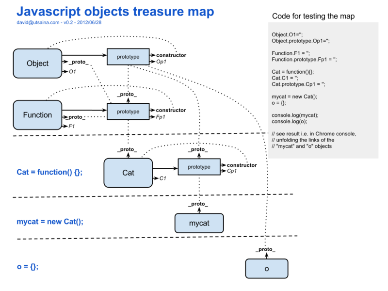

# Object Guide

`Object`是最基础的数据类型中的一种的`封装`。可以看成是`对象`这种原始数据的的的一种`包装对象`，可以构造出一个`对象`。就像其他数据类型的`包装对象`一样。

> *包装对象*用于给`原始数据类型`提供更多方法

我们常看到的 `json`格式的字符串，其实就是 `JavaScript Object Notation`，即`js对象表示法`。就是最开始用来描述js的对象的。

Object可以将任意类型转换为`对象`。（类似于`Number`封装函数只可以将数字转换为数字对象，通过这个数字对象可以操作这个数字，这些内容可以在其他`Number`中查看）

1. `__proto__`: 根据定义，__proto__ 是该对象(`Object`)的原型(`prototype`)的构造函数(`constructor`)引用。
2. `prototype`：该属性上定义的方法在当前对象的实例中可以直接调用
3. `constructor`：有这个属性的对象才能创建实例。2020年5月14日

`A instanceof B`: 在A的原型链上找B的构造函数`constructor`



## Object本身方法（构造函数本身独享的方法实例无法调用）

```js
Object.print = function (o) { console.log(o) };
Object.print()

// 自定义对象都是Object的实例
var Animal = function(){}
Animal.yap = function(name){
    console.log(name)
}
Animal.yap('wangwangwang')
```
## Object实例方法

绑定在属性 `prototype`上的方法。

## Object()函数

Object是对象的`包装对象`，可以将任意`数据类型`转换成对象。如果参数是原始数据类型就将参数转换成他对应的 `封装对象`。如果本身就是对象，那么就不转换，直接返回

```js
var obj = Object(1);
obj instanceof Object // true
obj instanceof Number // true

var obj = Object('foo');
obj instanceof Object // true
obj instanceof String // true

var obj = Object(true);
obj instanceof Object // true
obj instanceof Boolean // true
```
## Object构造函数

除了作为工具函数用于转换 `封装对象`，还可以生成新的的对象。
```js
var obj = new Object();// 生成新的对象obj
//等价于
obj = {}
//与下面中方法的结果虽然一样，都是由一个新的对象产生，但前者是生成新对象。后者是将参数转换为对象。
var obj = 1
var obj2  = Object(obj);//
```

## Object静态方法

```js
a = [1,2,3] //包含不可枚举属性length
Object.keys(obj) //返回一个list，包含obj自身的属性,可枚举的
Object.getOwnPropertyNames(obj) //返回一个lsit，包含obj自身的属性，包括不可枚举的
```

## Object实例方法

Object在属性prototype上定义了一些方法，这些方法在其实例中是可以直接调用的，称为`实例方法`。都可以在实例中被重写。


- `Object.prototype.valueOf()`：返回当前对象对应的值。
- `Object.prototype.toString()`：返回当前对象对应的字符串形式。Object.prototype.toString.call(value) 调用这个value上的Objec.protptype.toString方法
- `Object.prototype.toLocaleString()`：返回当前对象对应的本地字符串形式。也就是留个接口让不同对象实现自己的版本。和toString用法一样。
- `Object.prototype.hasOwnProperty()`：判断某个属性是否为当前对象自身的属性，还是继承自原型对象的属性。
- `Object.prototype.isPrototypeOf()`：判断当前对象是否为另一个对象的原型。
- `Object.prototype.propertyIsEnumerable()`：判断某个属性是否可枚举。


## 其他方法

1. 对象属性模型相关方法

- `Object.getOwnPropertyDescriptor()`：获取某个属性的描述对象。
- `Object.defineProperty()`：通过描述对象，定义某个属性。
- `Object.defineProperties()`：通过描述对象，定义多个属性。

2. 控制对象状态的方法

- `Object.preventExtensions()`：防止对象扩展。
- `Object.isExtensible()`：判断对象是否可扩展。
- `Object.seal()`：禁止对象配置。
- `Object.isSealed()`：判断一个对象是否可配置。
- `Object.freeze()`：冻结一个对象。
- `Object.isFrozen()`：判断一个对象是否被冻结。

3. 原型链相关方法

- `Object.create()`：该方法可以指定原型对象和属性，返回一个新的对象。
- `Object.getPrototypeOf()`：获取对象的Prototype对象。

-->[属性描述对象](./Attribute%20Object.md)（Attribute Object）,用来描述对象的属性的对象。本质也是一个`Object`的实例。

